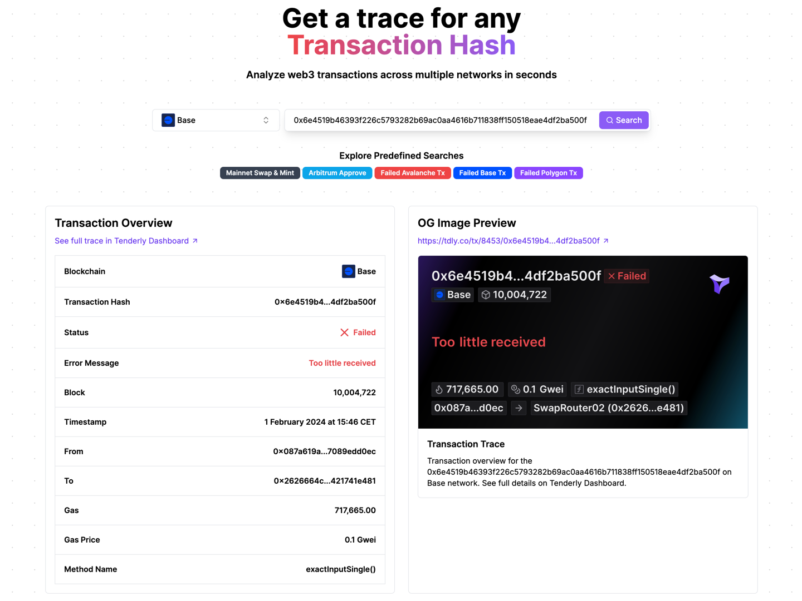

# txtrace.xyz

<div align="center">
    <a href="https://dashboard.tenderly.co/register">
        
    </a>
</div>

<div align="center">

[](./LICENSE)
[](https://twitter.com/intent/follow?screen_name=TenderlyApp)
[](https://github.com/dzimiks/txtrace.xyz)

</div>

TxTrace is an open-source web application that allows users to easily analyze blockchain transactions across multiple networks supported by [Tenderly](https://tenderly.co).

## Features

- Instant transaction trace visualization
- OG image preview for transactions
- Support for multiple Tenderly-supported networks
- One-click analysis of predefined transaction types

## Getting Started

1. Clone the repository:

```bash
git clone https://github.com/dzimiks/txtrace.xyz.git
```

2. Install dependencies:

```bash
cd txtrace.xyz
pnpm install
```

3. Set up environment variables (see `.env.example` for required variables)

4. Run the development server:

```bash
pnpm dev
```

5. Open http://localhost:3000 in your browser

## Contributing

We welcome contributions! Please see our [CONTRIBUTING.md](./CONTRIBUTING.md) for details on how to submit pull requests, report issues, or request features.

## License

This project is licensed under the MIT License - see the [LICENSE](./LICENSE) file for details.
